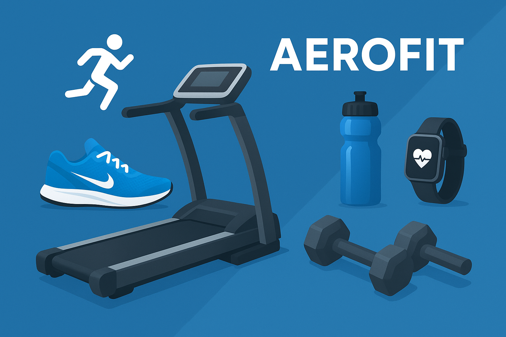

# Aerofit Customer Analytics

---

## 📖 About the Project
This project focuses on **customer segmentation and marketing insights** for Aerofit, a fitness equipment company.  
The work documented in the PDF report includes: **exploratory data analysis (EDA)**, **feature engineering (discretization/binning of continuous variables)**, **probability calculations**, and **hypothesis testing** to validate observed customer patterns.

📄 Full report available here:  
[`Aerofit_Customer_Analytics_Report`](Aerofit_Customer_Analytics_Report-Shivashish.pdf)

---

## 📂 Dataset
- **Source:** Aerofit customer purchase dataset  
- **Size:** 180 customer records  
- **Features (as in report):**  
  - `Product` (treadmill model purchased)  
  - `Age`  
  - `Gender`  
  - `Education`  
  - `Marital Status`  
  - `Usage` (times per week)  
  - `Fitness` (self-rated)  
  - `Income`  
  - `Miles` (average run per week)

---

## 🔎 Methods & Analysis Approach
1. **Exploratory Data Analysis (EDA)**  
   - Frequency distributions for demographics and product sales  
   - Crosstabs of purchase patterns by age, income, fitness, and usage  

2. **Feature Engineering (Discretization)**  
   - Converted continuous variables (`Age`, `Education`, `Income`, `Miles`) into categorical bins  
   - Age groups created: *Teens (0–20)*, *Adults (21–35)*, *Middle Aged (36–50)*, *Elderly (51+)*  
   - Income grouped into Low / Medium / High categories  
     

3. **Probability & Conditional Analysis**  
   - Computed purchase probabilities across different demographics  
   - Calculated conditional probabilities by age, usage, and income  

4. **Hypothesis Testing**  
   - Tested associations between customer attributes and treadmill model choice  
   - Used **Chi-square** and **ANOVA** tests where appropriate (as per the report)

---

## ❓ Key Business Questions
- Who are Aerofit’s main customers by demographics and fitness profile?  
- What are the purchase probabilities for each treadmill model across different customer groups?  
- Do income, age, or usage significantly influence treadmill choice?  
- How can Aerofit design better marketing strategies for its product segments?  

---

## 📊 Key Findings
- **Three models analyzed:** KP281, KP481, KP781  
- **KP281** → highest overall sales frequency  
- **KP781** → premium model, purchased mainly by higher-income and fitness-focused customers  
- **Age groups** → clear differences in treadmill preference across Teens, Adults, Middle-aged, and Elderly customers  
- **Hypothesis tests** confirmed: **income and usage frequency significantly influence treadmill choice**

---

## 💡 Recommendations
- **Promote KP781** via influencers/athletes to reinforce its premium positioning  
- **Target 50+ age group** with tailored campaigns to expand reach  
- **Provide post-purchase upgrade suggestions** to boost loyalty and lifetime value  
- **Segmented marketing** (examples: women preferring KP781, regular users of KP481, budget buyers of KP281)

---

## 📁 Organized Files & Clickable Placeholders
- 📄 Report: [`Aerofit_Customer_Analytics_Report`](Aerofit_Customer_Analytics_Report-Shivashish.pdf)    
- 📊 Data: [`aerofit_customers.csv`](data/aerofit.csv)  
- 🧾 Notebooks: [`Aerofit_Customer_Analytics.ipynb`](Aerofit_Customer_Segmentation_and_Marketing_Insights.ipynb) 
